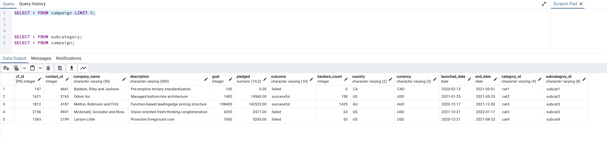
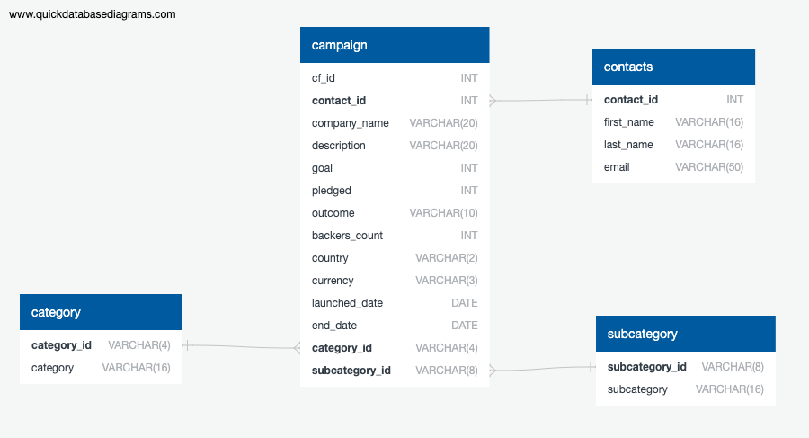
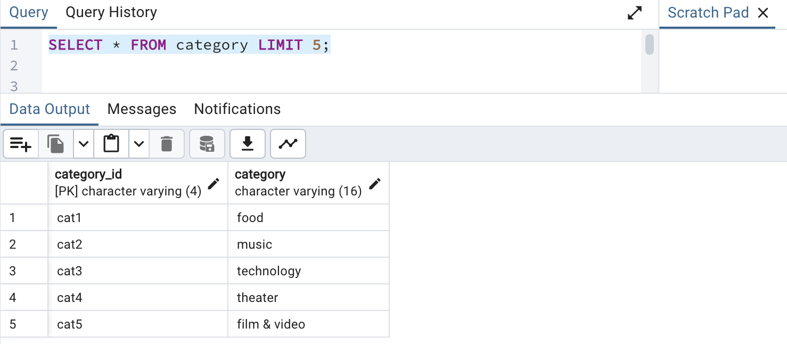
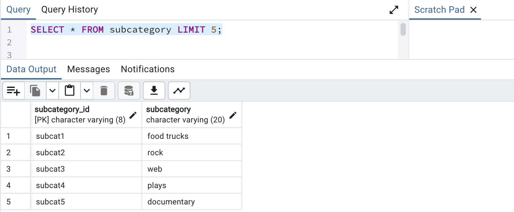
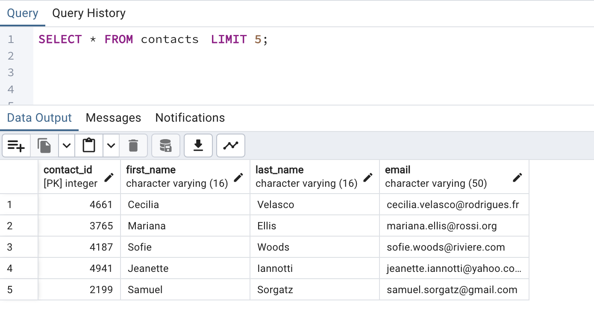

# Crowdfunding_ETL

## Website: 
[website](https://github.com/mrslinton/Crowdfunding_ETL)

## Description
Built an ETL pipeline using Python, Pandas, and Python dictionary methods to extract and transform campaign data, created four CSV files and used the file data to create an ERD and table schema 

## Table of Contents
- [Installation](#installation)
- [Usage](#usage)
- [Credits](#credits)
- [License](#license)
- [Features](#features)

- [Contact](#contact)

## Installation
Python, pandas, postgreSQL, QuickDBdiagrams, jupyter notebook

## Usage
Run ipynd file

## Credits
Jennifer Harris, Jarvis Cathey, Luke O'malley

## License
MIT

## Features
Dataframes, databases, ERD, images

## Contact
If there are any questions of concerns, I can be reached at:
##### [github: mrslinton](https://github.com/mrslinton)
##### [email: jennifer.v.harris@outlook.com](mailto:jennifer.v.harris@outlook.com)
